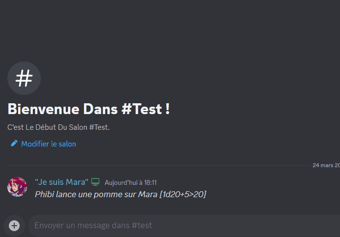

Le message détectera la notation des dés et enverra le résultat.

La notation des dés peut être faite de deux manières :
- Directe, comme `1d20` : Dans ce cas, le message "commandes" sera supprimé et le résultat sera envoyé dans le même canal (et dans le log).  

- Indirecte, entre crochets, comme : `mon contenu de message [1d20]`. Dans ce cas, le message sera conservé, et le contenu des crochets sera lancé. Vous recevrez une réponse avec le résultat et le log sera envoyé dans le fil. Les logs contiendront un lien vers le message d'origine.

- Semi-directe, comme `1d20 Mon message` : Aura le même comportement que la méthode direct. Le dés trouvé au départ sera lancé, et le reste du message sera envoyé dans le log et considéré comme un commentaire.

